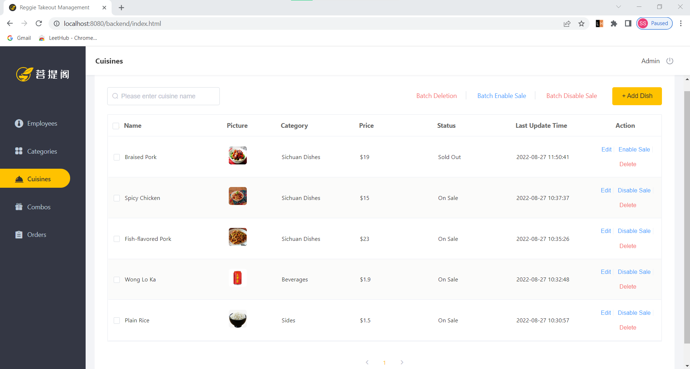

# ReggieTakeOut

#### Tools:
Git | Maven | Junit
#### Presentation tier:
H5 | VUE.js | ElementUI
#### Gateway tier: 
Nginx
#### Application tier:
Spring Boot | Spring MVC | Spring Session | Spring | Swagger | Lombok
#### Data tier:
Mysql | Redis | Mybatis | Mybatis Plus
***

## For Management: 

#### Employee Management:
+ Login & Logout
+ Add new employee
+ Edit employee's infomation
+ Show list of employee's infomation by page
+ Disable & Enable 
+ Search with employee's name

#### Category Management:
+ Add new category
+ Edit category infometion
+ Show list of categorys by page
+ Remove

#### Cuisine Management:
+ Add new cuisine with file upload and download
+ Edit cuisine infoemation
+ Show list of cusines by page
+ (Batch)Remove
+ (Batch)Enable sale & Disable sale
+ Search with cuisine name

#### Combo Management:
+ Add new combo with file upload and download
+ Edit combo information
+ Show list of combos by page
+ (Batch)Remove
+ (Batch)Enable sale & Disable sale
+ Search with combo name

#### Order Management:
+ Show list of orders by page
+ Search specific order with order number, start day and end day
***

## For Customer(Mobile):
+ Login by phone number
+ User Management
+ Address Management
+ History orders
+ Shopping Cart
+ Add to shopping cart 
+ Clear shopping cart
+ Checkout

